# Sistema de Cobros — Documentación Técnica y Flujos

> Documento de referencia del módulo de **Cobros (Collections)** de ArcNova.
> Basado en el código real de:
> - [`Services/CollectionServices.cs`](../Services/CollectionServices.cs)
> - [`Services/Extensions/Calculator.cs`](../Services/Extensions/Calculator.cs)
> - Entidades en [`Modal/`](../Modal/) (`Collection`, `MultipleInstallments`, `ConceptCollection`, `CollectionInstallment`, `CollectionStatusType`)
> - Front: [`SAPClient/app/src/views/pages/g.comertial/collections.vue`](../SAPClient/app/src/views/pages/g.comertial/collections.vue)
>
> Comprobación numérica de amortización: [calculator.net/amortization-calculator](https://www.calculator.net/amortization-calculator.html)

---

## 1. Contexto y dependencias

El cobro **depende por completo de la configuración de la venta**. La cadena de dependencias es:

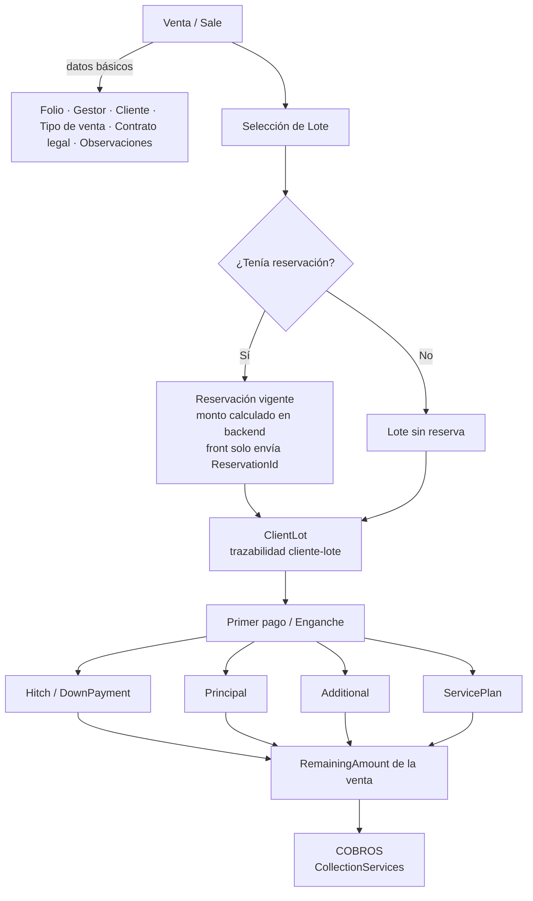
```mermaid
flowchart TD
    A[Venta / Sale] -->|datos básicos| A1[Folio · Gestor · Cliente · Tipo de venta · Contrato legal · Observaciones]
    A --> B[Selección de Lote]
    B --> C{¿Tenía reservación?}
    C -->|Sí| C1[Reservación vigente<br/>monto calculado en backend<br/>front solo envía ReservationId]
    C -->|No| C2[Lote sin reserva]
    C1 --> D[ClientLot<br/>trazabilidad cliente-lote]
    C2 --> D
    D --> E[Primer pago / Enganche]
    E --> F1[Hitch / DownPayment]
    E --> F2[Principal]
    E --> F3[Additional]
    E --> F4[ServicePlan]
    F1 --> G[RemainingAmount de la venta]
    F2 --> G
    F3 --> G
    F4 --> G
    G --> H[COBROS<br/>CollectionServices]
```

### 1.1 Reglas de las dependencias

- **`ClientLot`** ([`Modal/ClientLot.cs`](../Modal/ClientLot.cs)) almacena la trazabilidad lote↔cliente y su historia (reserva → venta), guardando el id completo de la relación.
- El **monto de la reserva aplica al total del lote**.
  Ejemplo: Lote = `100,000`; reserva = `500`.
- El **primer pago (enganche)** define el `Hitch`. El primer pago **no puede ser menor al enganche**: debe ser **igual o mayor**.
- Cada financiamiento **resta del total de la venta** y produce el `RemainingAmount`:

| Concepto | Monto | Se resta de la venta |
|---|---|---|
| Reserva | 500 | ✔ |
| Primer pago (enganche) | 500 | ✔ |
| Adicional | 1,000 | ✔ |
| **Total descontado** | **2,000** | |

  → `RemainingAmount = 100,000 - 2,000 = 98,000` (o `80,000` en el ejemplo de financiamiento de 81 cuotas).

- La **firma** es independiente a cobros.

### 1.2 Tipos de financiamiento (`FinancingTypes`)

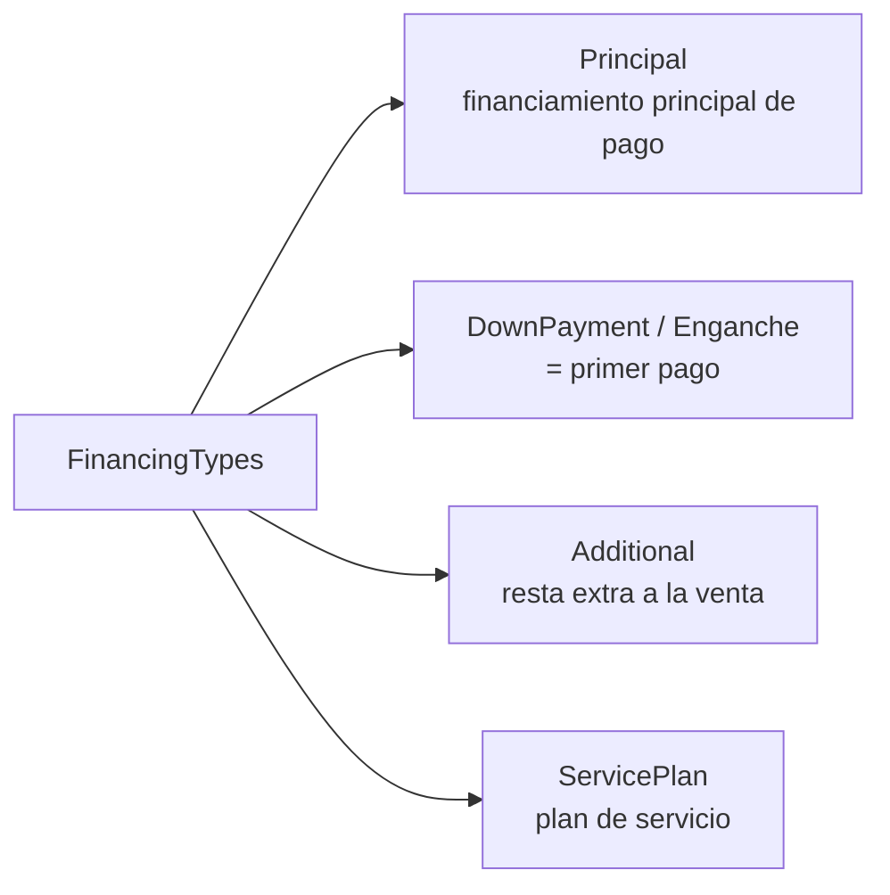
```mermaid
flowchart LR
    FT[FinancingTypes]
    FT --> P[Principal<br/>financiamiento principal de pago]
    FT --> D[DownPayment / Enganche<br/>= primer pago]
    FT --> AD[Additional<br/>resta extra a la venta]
    FT --> SP[ServicePlan<br/>plan de servicio]
```

Cada tipo tiene su tabla propia (`Principals`, `Hitches`, `Additionals`, `ServicePlans`) con: `PaymentByPeriod`, `PeriodInterest`, `InterestRate`, `ModalityId`, número de cuotas, fecha de inicio, `GracePeriod`, `IsSettled`, banderas de aplicar interés / aplicar mora.

---

## 2. Modelo de datos (cobros)

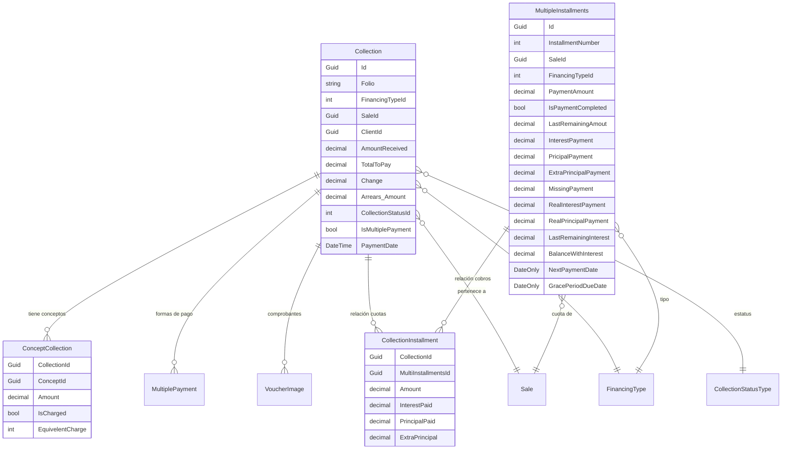
```mermaid
erDiagram
    Collection ||--o{ ConceptCollection : "tiene conceptos"
    Collection ||--o{ MultiplePayment : "formas de pago"
    Collection ||--o{ VoucherImage : "comprobantes"
    Collection ||--o{ CollectionInstallment : "relación cuotas"
    MultipleInstallments ||--o{ CollectionInstallment : "relación cobros"
    Collection }o--|| Sale : "pertenece a"
    Collection }o--|| FinancingType : "es de tipo"
    MultipleInstallments }o--|| Sale : "cuota de"
    MultipleInstallments }o--|| FinancingType : "tipo"
    Collection }o--|| CollectionStatusType : "estatus"

    Collection {
        Guid Id
        string Folio
        int FinancingTypeId
        Guid SaleId
        Guid ClientId
        decimal AmountReceived
        decimal TotalToPay
        decimal Change
        decimal Arrears_Amount
        int CollectionStatusId
        bool IsMultiplePayment
        DateTime PaymentDate
    }
    MultipleInstallments {
        Guid Id
        int InstallmentNumber
        Guid SaleId
        int FinancingTypeId
        decimal PaymentAmount
        bool IsPaymentCompleted
        decimal LastRemainingAmout
        decimal InterestPayment
        decimal PricipalPayment
        decimal ExtraPrincipalPayment
        decimal MissingPayment
        decimal RealInterestPayment
        decimal RealPrincipalPayment
        decimal LastRemainingInterest
        decimal BalanceWithInterest
        DateOnly NextPaymentDate
        DateOnly GracePeriodDueDate
    }
    CollectionInstallment {
        Guid CollectionId
        Guid MultiInstallmentsId
        decimal Amount
        decimal InterestPaid
        decimal PrincipalPaid
        decimal ExtraPrincipal
    }
    ConceptCollection {
        Guid CollectionId
        Guid ConceptId
        decimal Amount
        bool IsCharged
        int EquivelentCharge
    }
```

**Lectura del modelo:**
- `Collection` = el **cobro** (total a pagar `TotalToPay`, total recibido `AmountReceived`).
- `MultiplePayment` = las **múltiples formas de pago** con que se cubre ese cobro.
- `ConceptCollection` = los **conceptos** a pagar (incluye mora con `IsDelinquentPayer`).
- `MultipleInstallments` = la **cuota** generada (estado, saldos, fechas).
- `CollectionInstallment` = **tabla puente** cobro↔cuota (cuánto de ese cobro fue a esa cuota: `Amount`, `InterestPaid`, `PrincipalPaid`, `ExtraPrincipal`).

---

## 3. Motor de cálculo (amortización francesa)

Implementado en [`Calculator.cs`](../Services/Extensions/Calculator.cs).

### 3.1 Cuota por periodo — `CalculatePaymentesByPeriod`

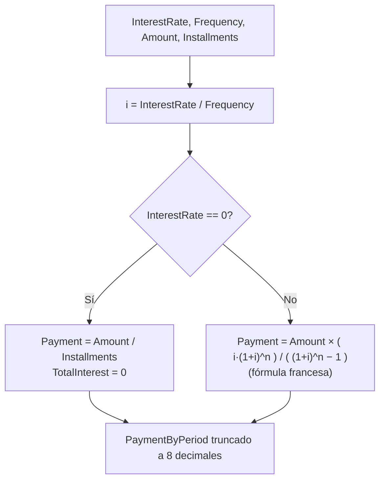
```mermaid
flowchart TD
    A[InterestRate, Frequency, Amount, Installments] --> B[i = InterestRate / Frequency]
    B --> C{InterestRate == 0?}
    C -->|Sí| D["Payment = Amount / Installments<br/>TotalInterest = 0"]
    C -->|No| E["Payment = Amount × ( i·(1+i)^n ) / ( (1+i)^n − 1 )<br/>(fórmula francesa)"]
    D --> F[PaymentByPeriod truncado a 8 decimales]
    E --> F
```

Ejemplo sin interés (del documento de contexto): `80,000 / 81 = 987.65 /mes`, total interés `0`.

### 3.2 Aplicación de un pago a la cuota — `CalculateNewPaymentD`

Es la pieza que decide **cuánto va a interés y cuánto a capital** en cada cobro:

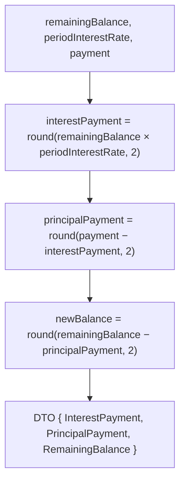
```mermaid
flowchart TD
    A["remainingBalance, periodInterestRate, payment"] --> B["interestPayment = round(remainingBalance × periodInterestRate, 2)"]
    B --> C["principalPayment = round(payment − interestPayment, 2)"]
    C --> D["newBalance = round(remainingBalance − principalPayment, 2)"]
    D --> E["DTO { InterestPayment, PrincipalPayment, RemainingBalance }"]
```

### 3.3 Fecha de vencimiento — `CalculateLastPaymentDate`

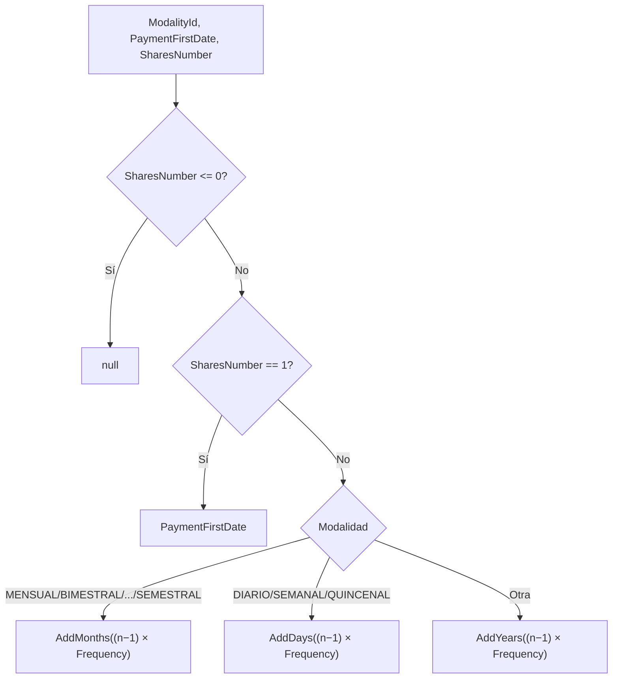
```mermaid
flowchart TD
    A[ModalityId, PaymentFirstDate, SharesNumber] --> B{SharesNumber <= 0?}
    B -->|Sí| Z[null]
    B -->|No| C{SharesNumber == 1?}
    C -->|Sí| D[PaymentFirstDate]
    C -->|No| E{Modalidad}
    E -->|MENSUAL/BIMESTRAL/.../SEMESTRAL| F["AddMonths((n−1) × Frequency)"]
    E -->|DIARIO/SEMANAL/QUINCENAL| G["AddDays((n−1) × Frequency)"]
    E -->|Otra| H["AddYears((n−1) × Frequency)"]
```

### 3.4 Periodos vencidos para mora — `CalculateLatePaymentByModality`

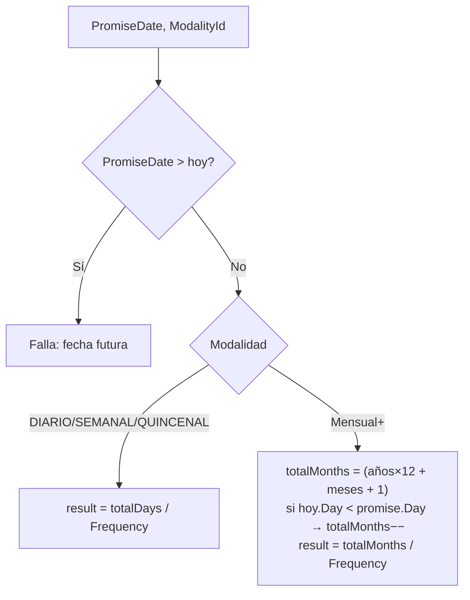
```mermaid
flowchart TD
    A[PromiseDate, ModalityId] --> B{PromiseDate > hoy?}
    B -->|Sí| F[Falla: fecha futura]
    B -->|No| C{Modalidad}
    C -->|DIARIO/SEMANAL/QUINCENAL| D[result = totalDays / Frequency]
    C -->|Mensual+| E["totalMonths = (años×12 + meses + 1)<br/>si hoy.Day < promise.Day → totalMonths−−<br/>result = totalMonths / Frequency"]
```

La penalización por periodo se calcula con `CalculateLatePaymentPenalty(PaymentByPeriod, DelinquencyRate)` y se multiplica por los periodos vencidos.

---

## 4. Reglas de negocio (invariantes)

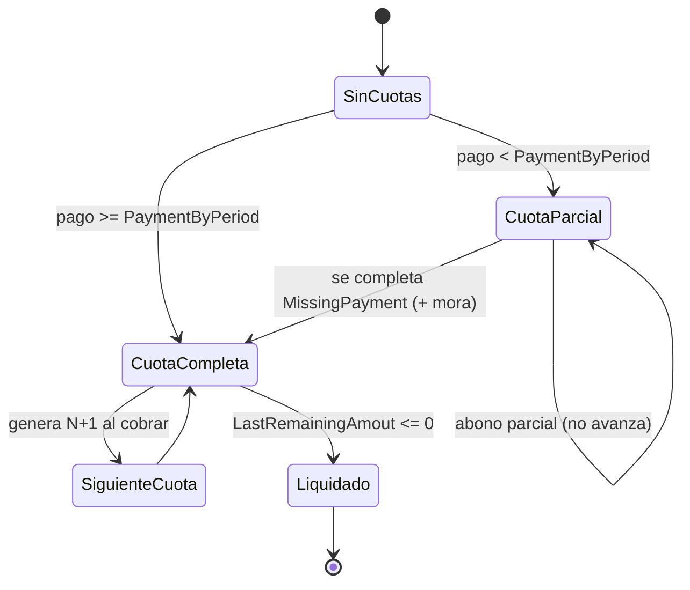
```mermaid
stateDiagram-v2
    [*] --> SinCuotas
    SinCuotas --> CuotaParcial : pago < PaymentByPeriod
    SinCuotas --> CuotaCompleta : pago >= PaymentByPeriod
    CuotaParcial --> CuotaParcial : abono parcial (no avanza)
    CuotaParcial --> CuotaCompleta : se completa MissingPayment (+ mora)
    CuotaCompleta --> SiguienteCuota : genera N+1 al cobrar
    SiguienteCuota --> CuotaCompleta
    CuotaCompleta --> Liquidado : LastRemainingAmout <= 0
    Liquidado --> [*]
```

Reglas codificadas (y dónde se validan):

| # | Regla | Validación en código |
|---|---|---|
| 1 | **Nunca se crean cuotas anticipadas** (las 81 no se generan; nacen al pagar) | `SaveInstallmentsPayment` genera 1 cuota por cobro |
| 2 | **Si no liquida la cuota actual, no brinca a la siguiente** | `lastInstallmentNumber != Installment` → error; partial bloquea avance |
| 3 | **No se elimina una cuota con cuotas por delante** | `DeleteInstallmentsPayment` → `thereAreInstallmentsAfeter`; `DeleteCollection` → `existCollectionAfter` |
| 4 | **Solo se elimina la última cuota generada** | misma validación que #3 |
| 5 | **De una cuota solo se actualiza el método de pago** | `UpdateInstallmentsPayment` valida que no exista cuota posterior |
| 6 | **Archivos adjuntos se pueden actualizar** | `UploadVoucherImage` / `DeleteVoucher` |
| 7 | **No se cobra si la venta está liquidada** | `IsSettled == true` / `SaleStatusCatalog.Settled` → error |
| 8 | **No se paga extra al pagar dos cuotas en el mismo cobro** | `IsExtra` solo se aplica si `InstallmentEquivalent == 1` |
| 9 | **No se pagan parcialidades en cuota equivalente a dos** | `InstallmentEquivalent > 1 && AmountReceived < TotalToPay` → error |
| 10 | **Pago incompleto → parcialidad; no avanza hasta cubrir mora** | `IsPaymentCompleted = pago < PaymentByPeriod ? false : true` |

---

## 5. Flujo principal: guardar un cobro por venta (`SaveCollectionBySale`)

Proceso lógico descrito por el negocio:
> Se guarda el **cobro** (total a pagar) → conceptos + múltiples pagos → la **cuota** (`MultipleInstallments`) → la **relación** (`CollectionInstallments`).

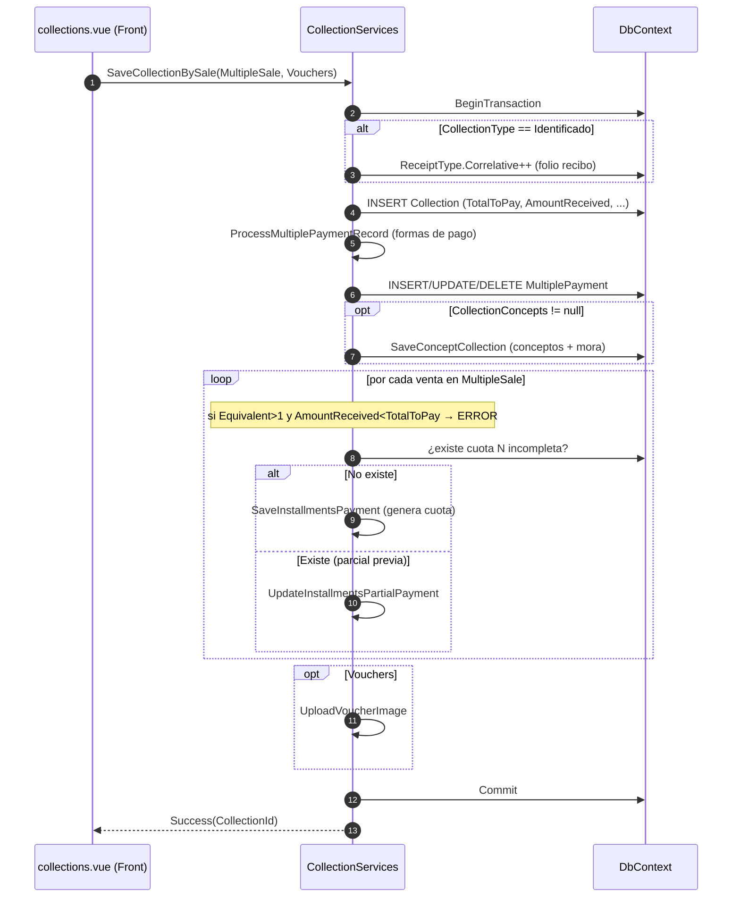
```mermaid
sequenceDiagram
    autonumber
    participant FE as collections.vue (Front)
    participant API as CollectionServices
    participant DB as DbContext

    FE->>API: SaveCollectionBySale(MultipleSale, Vouchers)
    API->>DB: BeginTransaction
    alt CollectionType == Identificado
        API->>DB: ReceiptType.Correlative++ (folio recibo)
    end
    API->>DB: INSERT Collection (TotalToPay, AmountReceived, ...)
    API->>API: ProcessMultiplePaymentRecord (formas de pago)
    API->>DB: INSERT/UPDATE/DELETE MultiplePayment
    opt CollectionConcepts != null
        API->>DB: SaveConceptCollection (conceptos + mora)
    end
    loop por cada venta en MultipleSale
        Note over API: si Equivalent>1 y AmountReceived<TotalToPay → ERROR
        API->>DB: ¿existe cuota N incompleta?
        alt No existe
            API->>API: SaveInstallmentsPayment (genera cuota)
        else Existe (parcial previa)
            API->>API: UpdateInstallmentsPartialPayment
        end
    end
    opt Vouchers
        API->>API: UploadVoucherImage
    end
    API->>DB: Commit
    API-->>FE: Success(CollectionId)
```

### 5.1 Ajuste de `PaymentByPeriod` cuando el cobro es "Identificado"

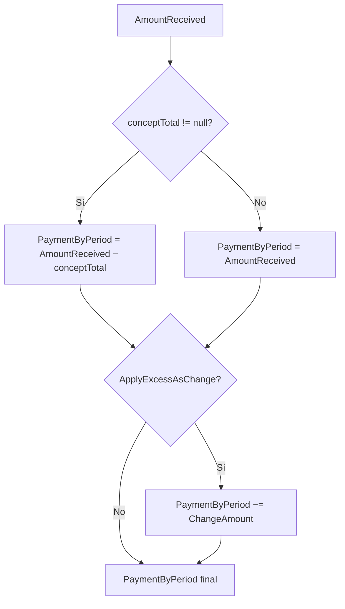
```mermaid
flowchart TD
    A[AmountReceived] --> B{conceptTotal != null?}
    B -->|Sí| C[PaymentByPeriod = AmountReceived − conceptTotal]
    B -->|No| D[PaymentByPeriod = AmountReceived]
    C --> E{ApplyExcessAsChange?}
    D --> E
    E -->|Sí| F[PaymentByPeriod −= ChangeAmount]
    E -->|No| G[PaymentByPeriod final]
    F --> G
```

> El **cambio/excedente** (`Change`) se resta del monto que efectivamente va al financiamiento.

---

## 6. Motor de cuotas: `SaveInstallmentsPayment`

Es el corazón del módulo. Genera la cuota `N`, aplica interés/capital, decide si está completa, fija fechas y liquida si el saldo llega a 0.

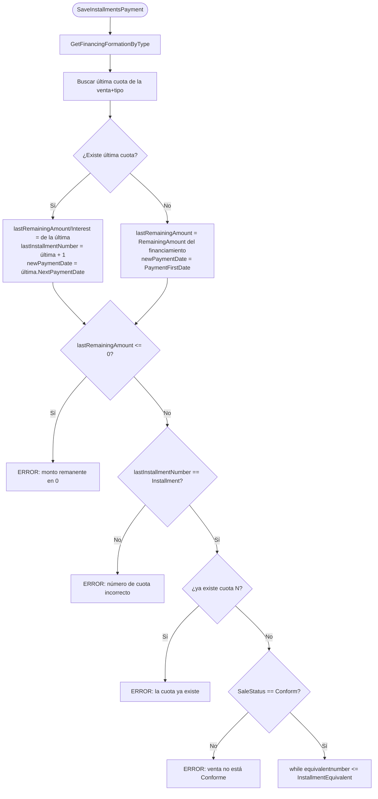
```mermaid
flowchart TD
    Start([SaveInstallmentsPayment]) --> A[GetFinancingFormationByType]
    A --> B[Buscar última cuota de la venta+tipo]
    B --> C{¿Existe última cuota?}
    C -->|Sí| C1[lastRemainingAmount/Interest = de la última<br/>lastInstallmentNumber = última + 1<br/>newPaymentDate = última.NextPaymentDate]
    C -->|No| C2[lastRemainingAmount = RemainingAmount del financiamiento<br/>newPaymentDate = PaymentFirstDate]
    C1 --> D{lastRemainingAmount <= 0?}
    C2 --> D
    D -->|Sí| E1[ERROR: monto remanente en 0]
    D -->|No| F{lastInstallmentNumber == Installment?}
    F -->|No| E2[ERROR: número de cuota incorrecto]
    F -->|Sí| G{¿ya existe cuota N?}
    G -->|Sí| E3[ERROR: la cuota ya existe]
    G -->|No| H{SaleStatus == Conform?}
    H -->|No| E4[ERROR: venta no está Conforme]
    H -->|Sí| LOOP[while equivalentnumber <= InstallmentEquivalent]
```

### 6.1 Detalle del bucle por cuota equivalente

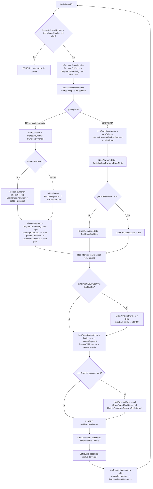
```mermaid
flowchart TD
    L0[Inicio iteración] --> L1{lastInstallmentNumber > InstallmentNumber del plan?}
    L1 -->|Sí| LE[ERROR: cuota > total de cuotas]
    L1 -->|No| L2["IsPaymentCompleted = PaymentByPeriod < PaymentByPeriod_plan ? false : true"]
    L2 --> L3[CalculateNewPaymentD: interés y capital del periodo]
    L3 --> P{¿Completa?}

    P -->|NO completa = parcial| Q1["interestResult = InterestPayment − PaymentByPeriod"]
    Q1 --> Q2{interestResult < 0}
    Q2 -->|Sí| Q3["PricipalPayment = |interestResult|<br/>LastRemainingAmout = saldo − principal"]
    Q2 -->|No >0| Q4["todo a interés<br/>PricipalPayment = 0<br/>saldo sin cambio"]
    Q3 --> Q5["MissingPayment = PaymentByPeriod_plan − pago<br/>NextPaymentDate = mismo periodo (no avanza)<br/>GracePeriodDueDate = del plan"]
    Q4 --> Q5

    P -->|COMPLETA| R1["LastRemainingAmout = newBalance<br/>InterestPayment/PricipalPayment = del cálculo"]
    R1 --> R2["NextPaymentDate = CalculateLastPaymentDate(N+1)"]
    R2 --> R3{¿GracePeriod definido?}
    R3 -->|Sí| R4["GracePeriodDueDate = GetGraceEndDate"]
    R3 -->|No| R5[GracePeriodDueDate = null]

    Q5 --> S[RealInterest/RealPrincipal = del cálculo]
    R4 --> S
    R5 --> S
    S --> T{InstallmentEquivalent==1 && IsExtra?}
    T -->|Sí| T1["ExtraPrincipalPayment = extra<br/>si extra > saldo → ERROR"]
    T -->|No| U
    T1 --> U["LastRemainingInterest = lastInterest − InterestPayment<br/>BalanceWithInterest = saldo + interés"]
    U --> V{LastRemainingAmout <= 0?}
    V -->|Sí| V1["NextPaymentDate = null<br/>GracePeriodDueDate = null<br/>UpdateFinancingStatus(IsSettled=true)"]
    V -->|No| W
    V1 --> W[INSERT MultipleInstallments]
    W --> X[SaveCollectonInstallment: relación cobro↔cuota]
    X --> Y["SettleSale (recalcula estatus de venta)"]
    Y --> Z["lastRemaining = nuevo saldo<br/>equivalentnumber++<br/>lastInstallmentNumber++"]
    Z --> L0
```

### 6.2 Persistencia final (orden exacto)

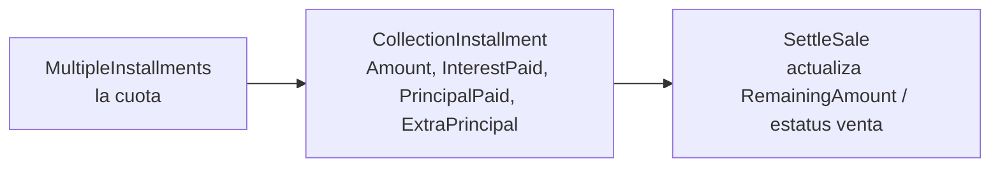
```mermaid
flowchart LR
    A[MultipleInstallments<br/>la cuota] --> B[CollectionInstallment<br/>Amount, InterestPaid, PrincipalPaid, ExtraPrincipal]
    B --> C[SettleSale<br/>actualiza RemainingAmount / estatus venta]
```

---

## 7. Pagos parciales y mora

### 7.1 Cobro de una cuota parcial existente — `UpdateInstallmentsPartialPayment`

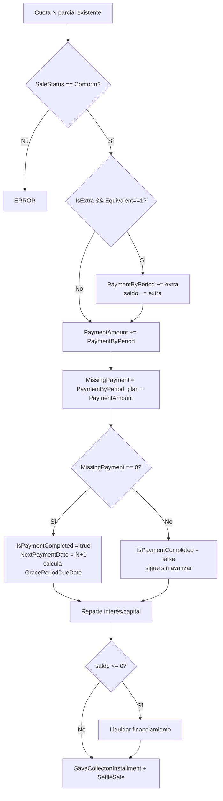
```mermaid
flowchart TD
    A[Cuota N parcial existente] --> B{SaleStatus == Conform?}
    B -->|No| E[ERROR]
    B -->|Sí| C{IsExtra && Equivalent==1?}
    C -->|Sí| C1[PaymentByPeriod −= extra<br/>saldo −= extra]
    C -->|No| D
    C1 --> D[PaymentAmount += PaymentByPeriod]
    D --> F[MissingPayment = PaymentByPeriod_plan − PaymentAmount]
    F --> G{MissingPayment == 0?}
    G -->|Sí| G1[IsPaymentCompleted = true<br/>NextPaymentDate = N+1<br/>calcula GracePeriodDueDate]
    G -->|No| G2[IsPaymentCompleted = false<br/>sigue sin avanzar]
    G1 --> H[Reparte interés/capital]
    G2 --> H
    H --> I{saldo <= 0?}
    I -->|Sí| I1[Liquidar financiamiento]
    I -->|No| J
    I1 --> J[SaveCollectonInstallment + SettleSale]
```

### 7.2 Cálculo de mora en el próximo cobro — `ValidateNextCollection`

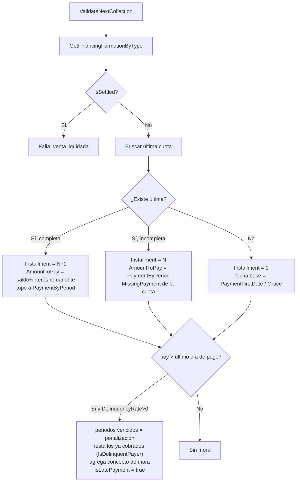
```mermaid
flowchart TD
    A[ValidateNextCollection] --> B[GetFinancingFormationByType]
    B --> C{IsSettled?}
    C -->|Sí| Z[Falla: venta liquidada]
    C -->|No| D[Buscar última cuota]
    D --> E{¿Existe última?}
    E -->|Sí, completa| F[Installment = N+1<br/>AmountToPay = saldo+interés remanente<br/>tope a PaymentByPeriod]
    E -->|Sí, incompleta| G[Installment = N<br/>AmountToPay = PaymentByPeriod<br/>MissingPayment de la cuota]
    E -->|No| H[Installment = 1<br/>fecha base = PaymentFirstDate / Grace]
    F --> I{hoy > último día de pago?}
    G --> I
    H --> I
    I -->|Sí y DelinquencyRate>0| J["periodos vencidos × penalización<br/>resta los ya cobrados (IsDelinquentPayer)<br/>agrega concepto de mora<br/>IsLatePayment = true"]
    I -->|No| K[Sin mora]
```

> La mora se agrega como un **`CollectionConcept`** con `IsDelinquentPayer = true` y `EquivelentCharge` = nº de periodos cobrados, para no duplicar la mora ya pagada.

---

## 8. Actualización de un cobro (`UpdateCollectionBySale`)

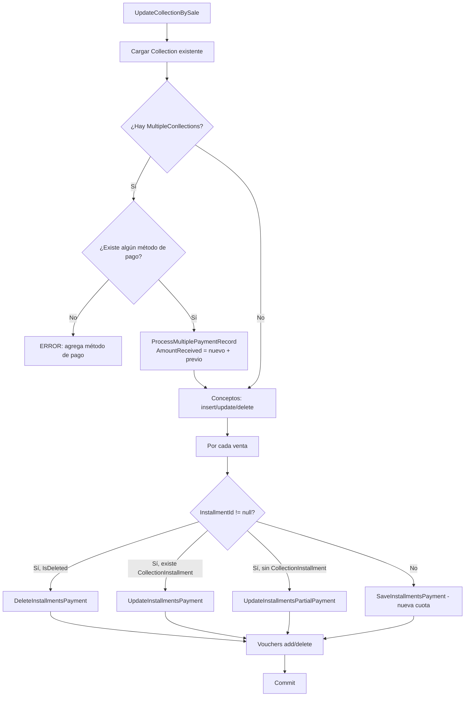
```mermaid
flowchart TD
    A[UpdateCollectionBySale] --> B[Cargar Collection existente]
    B --> C{¿Hay MultipleConllections?}
    C -->|Sí| C1{¿Existe algún método de pago?}
    C1 -->|No| CE[ERROR: agrega método de pago]
    C1 -->|Sí| C2[ProcessMultiplePaymentRecord<br/>AmountReceived = nuevo + previo]
    C -->|No| D
    C2 --> D[Conceptos: insert/update/delete]
    D --> E[Por cada venta]
    E --> F{InstallmentId != null?}
    F -->|Sí, IsDeleted| F1[DeleteInstallmentsPayment]
    F -->|Sí, existe CollectionInstallment| F2[UpdateInstallmentsPayment]
    F -->|Sí, sin CollectionInstallment| F3[UpdateInstallmentsPartialPayment]
    F -->|No| F4[SaveInstallmentsPayment - nueva cuota]
    F1 --> G[Vouchers add/delete]
    F2 --> G
    F3 --> G
    F4 --> G
    G --> H[Commit]
```

`UpdateInstallmentsPayment` (actualizar cuota ya pagada) primero valida que **no exista cuota N+1** y que la venta **no esté liquidada**, luego revierte el `CollectionInstallment` previo y reaplica el nuevo monto.

---

## 9. Eliminación

### 9.1 Eliminar el pago de una cuota — `DeleteInstallmentsPayment`

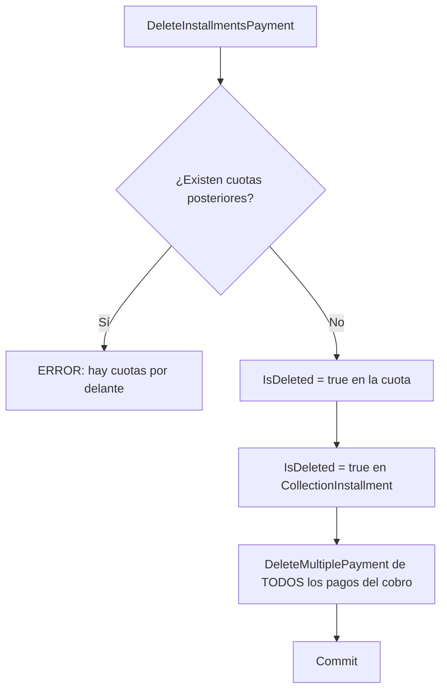
```mermaid
flowchart TD
    A[DeleteInstallmentsPayment] --> B{¿Existen cuotas posteriores?}
    B -->|Sí| E[ERROR: hay cuotas por delante]
    B -->|No| C[IsDeleted = true en la cuota]
    C --> D[IsDeleted = true en CollectionInstallment]
    D --> F[DeleteMultiplePayment de TODOS los pagos del cobro]
    F --> G[Commit]
```

### 9.2 Eliminar un cobro completo — `DeleteCollection`

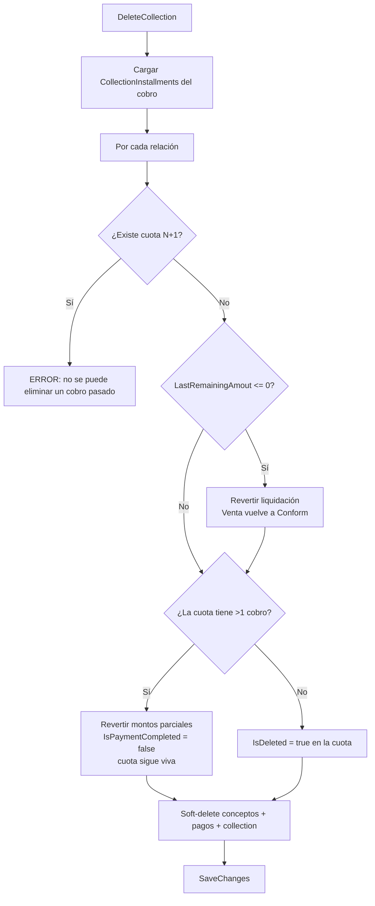
```mermaid
flowchart TD
    A[DeleteCollection] --> B[Cargar CollectionInstallments del cobro]
    B --> C[Por cada relación]
    C --> D{¿Existe cuota N+1?}
    D -->|Sí| E[ERROR: no se puede eliminar un cobro pasado]
    D -->|No| F{LastRemainingAmout <= 0?}
    F -->|Sí| F1[Revertir liquidación<br/>Venta vuelve a Conform]
    F -->|No| G
    F1 --> G{¿La cuota tiene >1 cobro?}
    G -->|Sí| G1[Revertir montos parciales<br/>IsPaymentCompleted = false<br/>cuota sigue viva]
    G -->|No| G2[IsDeleted = true en la cuota]
    G1 --> H[Soft-delete conceptos + pagos + collection]
    G2 --> H
    H --> I[SaveChanges]
```

---

## 10. Cobro vía Stripe (`CreateCollectionFromStripePaymentIntentAsync`)

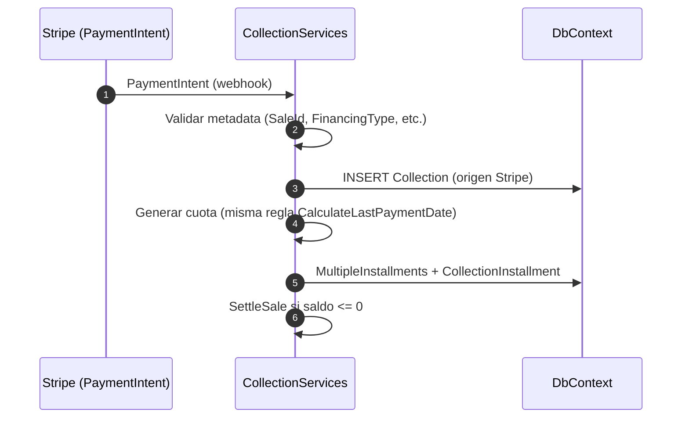
```mermaid
sequenceDiagram
    autonumber
    participant ST as Stripe (PaymentIntent)
    participant API as CollectionServices
    participant DB as DbContext
    ST->>API: PaymentIntent (webhook)
    API->>API: Validar metadata (SaleId, FinancingType, etc.)
    API->>DB: INSERT Collection (origen Stripe)
    API->>API: Generar cuota (misma regla CalculateLastPaymentDate)
    API->>DB: MultipleInstallments + CollectionInstallment
    API->>API: SettleSale si saldo <= 0
```

> Stripe usa **la misma regla de vencimientos** (`CalculateLastPaymentDate`) que el cobro manual; ver nota en [`MultipleInstallments.NextPaymentDate`](../Modal/MultipleInstallments.cs).

---

## 11. Ejemplo numérico de referencia

Lote `100,000`, descuentos `2,000` (reserva + enganche + adicional) → financiamiento `80,000`, **0% interés**, **81 meses**:

```
PaymentByPeriod = 80,000 / 81 = 987.65 / mes
Total de 81 pagos = 80,000.00
Total interés    = 0.00
```

| Año | Interés | Capital | Saldo final |
|---|---|---|---|
| 1 | 0.00 | 11,851.85 | 68,148.15 |
| 2 | 0.00 | 11,851.85 | 56,296.30 |
| 3 | 0.00 | 11,851.85 | 44,444.44 |
| 4 | 0.00 | 11,851.85 | 32,592.59 |
| 5 | 0.00 | 11,851.85 | 20,740.74 |
| 6 | 0.00 | 11,851.85 | 8,888.89 |
| 7 | 0.00 | 8,888.89  | 0.00 |

Cada cuota se cobra mes a mes; **la cuota N+1 solo nace cuando se cobra**.
---

## 13. Resumen del flujo end-to-end

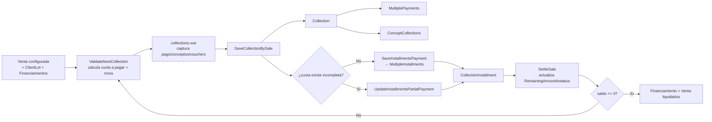
```mermaid
flowchart LR
    V[Venta configurada<br/>+ ClientLot + Financiamientos] --> NEXT[ValidateNextCollection<br/>calcula cuota a pagar + mora]
    NEXT --> FE[collections.vue<br/>captura pago/conceptos/vouchers]
    FE --> SAVE[SaveCollectionBySale]
    SAVE --> COL[Collection]
    COL --> MP[MultiplePayments]
    COL --> CC[ConceptCollections]
    SAVE --> ENG{¿cuota existe incompleta?}
    ENG -->|No| GEN[SaveInstallmentsPayment<br/>→ MultipleInstallments]
    ENG -->|Sí| PAR[UpdateInstallmentsPartialPayment]
    GEN --> CI[CollectionInstallment]
    PAR --> CI
    CI --> SS[SettleSale<br/>actualiza RemainingAmount/estatus]
    SS --> LIQ{saldo <= 0?}
    LIQ -->|Sí| FIN[Financiamiento + Venta liquidados]
    LIQ -->|No| NEXT
```
